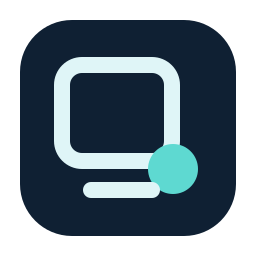

# Daydream branding

Daydream uses quiet geometric forms. The marks show bubbles that float without visual noise.

## Selected default: Orbit Bubble

Orbit Bubble is the selected default. It has one large bubble, one inner space, and one small companion bubble. The status item uses the same large-and-small bubble relation. The app icon renderer uses this concept.

## Other editable concepts

### Open Window

Open Window uses a small open window shape and one bubble. It connects Daydream to a screen without showing a display illustration.

### Two Bubbles

Two Bubbles uses an outlined large bubble and a filled small bubble. It is the lightest mark at small sizes.

All three source files are editable SVG files in [Design/LogoConcepts](../Design/LogoConcepts/). They use solid colors only. They do not use gradients, faces, sparkle marks, or detailed illustration.
